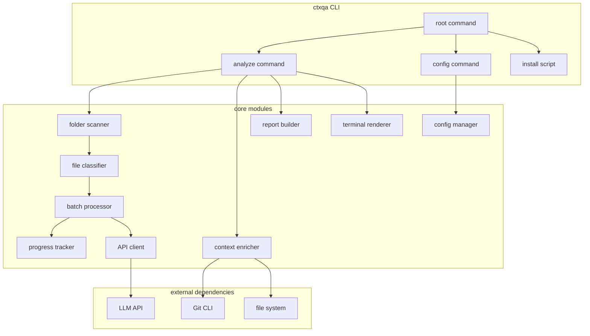

# ctxqa - AI-Powered Folder Analyzer CLI

Feature Name: 260715-context-aware-cli-qa
Updated: 2026-07-15

## Description

ctxqa is a fully open-source terminal CLI tool that performs AI-powered analysis of any folder. Users can provide their own API key, one-click install, everything runs in the terminal. Core value: when run in any folder, it traverses the entire directory tree, sends file contents to an LLM in batches, and proactively outputs a structured analysis report covering: file structure overview, folder/file organization suggestions, progress analysis, issue detection, quality scores, and improvement recommendations.

## Architecture



## Components and Interfaces

### 1. Root Command

Parses global flags (`--version`, `--help`, `--license`) and routes to subcommands.

**Entry file**: `cmd/ctxqa/main.go`

**Global flags**:
| Flag | Type | Description |
|------|------|-------------|
| `--version` | bool | Output version and exit |
| `--help` | bool | Output help and exit |
| `--license` | bool | Output license text and exit |
| `--verbose` | bool | Enable verbose logging |
| `--config` | string | Config file path (default `~/.config/ctxqa/config.json`) |

### 2. Analyze Command (Audit)

Core feature entry point. Traverses folder files, batches them, calls LLM, and renders the analysis report.

**Entry file**: `cmd/ctxqa/cmd/audit.go`

**Subcommands**:
| Command | Description |
|------|------|
| `ctxqa analyze` | Full folder analysis with report |
| `ctxqa analyze --incremental` | Incremental analysis (changed files only) |
| `ctxqa analyze --resume` | Resume from interrupted analysis |
| `ctxqa analyze --diff` | Compare with last analysis result |

**Flags**:
| Flag | Short | Default | Description |
|------|-------|---------|-------------|
| `--format` | `-f` | `text` | Output format: text, json, markdown |
| `-o`, `--output` | | stdout | Output file path |
| `--severity` | | `all` | Minimum severity: all, info, warning, error, critical |
| `--section` | | `all` | Specific section: overview, structure, progress, issues, suggestions |
| `--incremental` | | `false` | Incremental analysis mode |
| `--resume` | | `false` | Resume from last checkpoint |
| `--diff` | | `false` | Compare with last result |
| `--no-context` | | `false` | Skip context collection |
| `--dir` | `-d` | `.` | Folder to analyze |
| `--concurrency` | `-j` | `1` | Parallel batch processors |
| `--dry-run` | | `false` | List files only, do not analyze |
| `--summary` | | `false` | Brief summary only |

### 3. Config Command

Manages user configuration including API key, provider, model, and analysis preferences.

**Entry file**: `cmd/ctxqa/cmd/config.go`

**Subcommands**:
| Command | Description |
|------|------|
| `ctxqa config init` | Interactive configuration wizard |
| `ctxqa config show` | Display current configuration |
| `ctxqa config set-provider [openai\|anthropic]` | Set API provider |
| `ctxqa config set-model <name>` | Set model name |
| `ctxqa config set-api-key` | Set API key interactively |
| `ctxqa config set max-file-size <bytes>` | Set max single file size |
| `ctxqa config set batch-size <count>` | Set files per batch |
| `ctxqa config exclude-add <patterns...>` | Add exclusion patterns |
| `ctxqa config exclude-remove <patterns...>` | Remove exclusion patterns |
| `ctxqa config reset` | Reset to defaults |

### 4. Folder Scanner (File Scanner)

Traverses all files in a folder and its subfolders, classifies them by type.

**Entry file**: `pkg/filesystem/scanner.go`

**Features**:
- Recursively traverse the specified directory
- Classify files by type: code, document, image, media, archive, data, config
- Skip binary files, build artifacts, and excluded directories
- Count files and total size by type and by top-level directory
- Support `--dry-run` to list files only

**Built-in exclusion rules**:
- `.git/`, `.svn/` directories
- `node_modules/`, `vendor/` directories
- `.terraform/`, `.aws/`, `.azure/` directories
- `dist/`, `build/`, `.output/`, `target/` directories
- `__pycache__/`, `.pytest_cache/`, `.mypy_cache/` directories
- `*.lock`, `*.sum`, `*.pb.go` files
- `*.min.js`, `*.min.css` files
- `*.png`, `*.jpg`, `*.gif`, `*.ico`, `*.svg`, `*.woff`, `*.woff2`, `*.ttf` files
- `.config/ctxqa/` directory
- User-configured custom exclusion patterns

**File type classification**:
| Category | Extensions |
|----------|-----------|
| Code | `.go`, `.ts`, `.tsx`, `.js`, `.jsx`, `.py`, `.rb`, `.rs`, `.java`, `.c`, `.cpp`, `.h`, `.hpp`, `.cs`, `.swift`, `.kt`, `.scala`, `.php`, `.sh`, `.bash`, `.zsh` |
| Config | `.yaml`, `.yml`, `.toml`, `.json`, `.xml`, `.ini`, `.conf`, `.env` |
| Data | `.csv`, `.parquet`, `.avro`, `.db`, `.sqlite` |
| Document | `.md`, `.txt`, `.pdf`, `.doc`, `.docx` |
| Web | `.html`, `.css`, `.scss`, `.vue`, `.svelte` |
| Other | `.proto`, `.graphql`, `.sql` |

### 5. Batch Processor

Responsible for batching files, controlling batch size within model context window limits.

**Entry file**: `pkg/filesystem/batcher.go`

**Strategy**:
1. Group files by type, same-type files in the same batch
2. Each batch total chars does not exceed `max_batch_chars` (default 100000, ~75000 tokens)
3. Single file exceeding `max_file_size` (default 1MB) forms its own batch
4. Batch count = ceil(total chars / max_batch_chars)
5. Support parallel processing (controlled by `--concurrency`)

**Batch prompt** includes:
- File paths and types
- File contents
- Request for: folder overview, file structure analysis, organization suggestions, progress analysis, issues, quality scores, improvement suggestions

### 6. Progress Tracker

Responsible for real-time progress display during analysis.

**Entry file**: `pkg/progress/tracker.go`

**Features**:
- Display current batch progress bar
- Display processed file count and total file count
- Display elapsed time and estimated remaining time
- Support Ctrl+C interrupt with progress saved to `~/.config/ctxqa/.last_run.json`
- Support `--resume` to continue from checkpoint

### 7. Context Enricher

Collects context information to enhance the analysis report.

**Entry file**: `pkg/context/enricher.go`

**Collected items**:
| Item | Source | Limit |
|------|--------|-------|
| Git branch | `git branch --show-current` | Skip if not a Git repo |
| Command history | `~/.bash_history` / `~/.zsh_history` | Last 20 entries |
| Git commits | `git log --oneline -10` | Last 10 commits |
| Changed files | `git diff --name-only HEAD` | Used in incremental mode |
| Tech stack | `package.json`, `go.mod`, `Cargo.toml`, etc. | Auto-detect |

### 8. Report Builder (Report Generator)

Aggregates all batch analysis results into a structured report.

**Entry file**: `pkg/report/builder.go`

**Report structure**:
```
# Folder Analysis Report

## 1. Folder Overview
- Folder path: {folder_path}
- Total files: {total_files}
- Total size: {total_size}
- File type breakdown: {file_type_breakdown}
- Top-level directories: {top_directories}
- Tech stack detected: {tech_stack}
- Git branch: {branch}
- Recent commits: {recent_commits}

## 2. File Structure and Organization Suggestions
{organization_analysis}
- Current structure summary
- Proposed reorganization plan
- File grouping recommendations
- Naming convention suggestions
- Duplicate file detection

## 3. Progress Analysis
{progress_analysis}
- Completed work (based on file content and commit history)
- Work in progress
- Pending tasks

## 4. Issues Found
### Critical
{critical_issues}

### Error
{error_issues}

### Warning
{warning_issues}

### Info
{info_issues}

## 5. Quality Scores
### Naming Conventions
{naming_score} / 10

### Error Handling
{error_handling_score} / 10

### Code Duplication
{duplication_score} / 10

### Security
{security_score} / 10

### Overall Score
{overall_score} / 10

## 6. Improvement Suggestions
### High Priority
{high_priority_suggestions}

### Medium Priority
{medium_priority_suggestions}

### Low Priority
{low_priority_suggestions}
```

**Output format support**:
| Format | Description |
|------|------|
| `text` | Plain text, suitable for direct terminal display |
| `json` | JSON format, suitable for programmatic processing |
| `markdown` | Markdown format, can be saved to file |

### 9. API Client

Communicates with LLM APIs, supporting both OpenAI and Anthropic formats.

**Entry file**: `pkg/api/client.go`

**Supported API providers**:
| Provider | Default Base URL | Interface format |
|------|------|------|
| OpenAI | `https://api.openai.com/v1` | Chat Completions API |
| Anthropic | `https://api.anthropic.com/v1` | Messages API |

**OpenAI format**:
```
POST {base_url}/chat/completions
Headers:
  Authorization: Bearer {api_key}
  Content-Type: application/json
Body:
{
  "model": "{model}",
  "messages": [
    {"role": "system", "content": "{system_prompt}"},
    {"role": "user", "content": "{batch_prompt}"}
  ],
  "temperature": 0.0,
  "max_tokens": 8192,
  "stream": true
}
```

**Anthropic format**:
```
POST {base_url}/messages
Headers:
  x-api-key: {api_key}
  anthropic-version: 2023-06-01
  Content-Type: application/json
Body:
{
  "model": "{model}",
  "messages": [
    {"role": "user", "content": "{full_prompt}"}
  ],
  "system": "{system_prompt}",
  "temperature": 0.0,
  "max_tokens": 8192,
  "stream": true
}
```

**Features**:
- Stream output (SSE)
- Request timeout 120 seconds, configurable
- Auto-retry 3 times (exponential backoff: 2s, 4s, 8s)
- Error code mapping to friendly messages
- Temperature fixed at 0.0 for deterministic output
- Configurable `max_tokens`

### 10. Config Manager

Manages reading and writing user configuration files.

**Entry file**: `pkg/config/manager.go`

**Config file path**: `~/.config/ctxqa/config.json`

**Configuration structure**:
```json
{
  "provider": "openai",
  "api_key": "",
  "base_url": "https://api.openai.com/v1",
  "model": "gpt-4o",
  "max_file_size": 1048576,
  "batch_size": 50,
  "max_batch_chars": 100000,
  "timeout_seconds": 120,
  "retry_count": 3,
  "context": {
    "exclude": [],
    "collect_history": true,
    "collect_commits": true
  },
  "defaults": {
    "severity": "all",
    "format": "text"
  }
}
```

### 11. Terminal Renderer

Responsible for displaying output content beautifully in the terminal.

**Entry file**: `pkg/renderer/renderer.go`

**Features**:
- Markdown text rendering (code block highlighting, tables, lists)
- Color output (critical red, error orange-red, warning yellow, info blue)
- Progress bar display
- Score visualization
- Section headers and separators

### 12. Install Script

Provides one-click installation.

**Entry file**: `scripts/install.sh`

**Installation process**:
1. Detect OS (`uname -s`) and architecture (`uname -m`)
2. Download matching binary from GitHub Releases
3. Verify SHA256 hash
4. Copy to target directory
5. Verify installation

**Target directory priority**:
1. `$HOME/.local/bin` (if exists and in PATH)
2. `/usr/local/bin` (requires sudo)
3. `$HOME/bin`

## Data Models

### Analysis Report Data Structure

```go
type AnalysisReport struct {
    Metadata   ReportMetadata    `json:"metadata"`
    Overview   OverviewSection   `json:"overview"`
    Structure  StructureSection  `json:"structure"`
    Progress   ProgressSection   `json:"progress"`
    Issues     IssuesSection     `json:"issues"`
    Quality    QualitySection    `json:"quality"`
    Suggestions []Suggestion     `json:"suggestions"`
}

type ReportMetadata struct {
    FolderPath   string    `json:"folder_path"`
    Branch        string    `json:"branch"`
    TotalFiles    int       `json:"total_files"`
    TotalSize     int64     `json:"total_size"`
    FileTypeBreakdown map[string]int `json:"file_type_breakdown"`
    TopDirectories []DirStat `json:"top_directories"`
    TechStack    []string  `json:"tech_stack"`
    GeneratedAt  time.Time `json:"generated_at"`
    Version      string    `json:"version"`
}

type DirStat struct {
    Path   string `json:"path"`
    Files  int    `json:"files"`
    Size   int64  `json:"size"`
}

type StructureSection struct {
    CurrentStructure    string   `json:"current_structure"`
    ProposedStructure   string   `json:"proposed_structure"`
    GroupingSuggestions []string `json:"grouping_suggestions"`
    NamingIssues        []string `json:"naming_issues"`
    DuplicateFiles      []string `json:"duplicate_files"`
}

type ProgressSection struct {
    Completed []Feature `json:"completed"`
    Running   []Feature `json:"in_progress"`
    Pending   []Feature `json:"pending"`
}

type Feature struct {
    Name        string   `json:"name"`
    Description string   `json:"description"`
    Files       []string `json:"files"`
    Status      string   `json:"status"`
}

type IssuesSection struct {
    Critical []Issue `json:"critical"`
    Error    []Issue `json:"error"`
    Warning  []Issue `json:"warning"`
    Info     []Issue `json:"info"`
}

type Issue struct {
    File       string `json:"file"`
    Line       int    `json:"line"`
    Severity   string `json:"severity"`
    Category   string `json:"category"`
    Message    string `json:"message"`
    Suggestion string `json:"suggestion,omitempty"`
}

type QualitySection struct {
    NamingScore        int `json:"naming_score"`
    ErrorHandlingScore int `json:"error_handling_score"`
    DuplicationScore   int `json:"duplication_score"`
    SecurityScore      int `json:"security_score"`
    OverallScore       int `json:"overall_score"`
}

type Suggestion struct {
    Priority string   `json:"priority"`
    Category string   `json:"category"`
    Title    string   `json:"title"`
    Detail   string   `json:"detail"`
    Files    []string `json:"files"`
}
```

## Correctness Properties

1. **Config security**: Config file permissions must be `0600`, readable and writable by owner only
2. **API key protection**: API key value must never be printed in logs, terminal output, or error messages
3. **File read safety**: Files exceeding `max_file_size` are automatically skipped with a warning logged
4. **API call security**: All API requests must carry auth headers; requests without an API key are rejected with a configuration prompt
5. **Input validation**: Target folder path must be validated to prevent path traversal (`..` escaping target directory)
6. **Deterministic output**: Temperature fixed at 0.0 in the prompt ensures consistent output for identical inputs
7. **Progress persistence**: On resume, completed batches and files are not re-analyzed
8. **Memory limit**: Memory usage stays under 500MB during analysis via batch processing and streaming reads

## Error Handling

| Error scenario | Handling |
|------|------|
| API key not configured | Prompt user to run `ctxqa config init` |
| API key invalid (401) | Output "API key invalid, please reconfigure", prompt `ctxqa config set-api-key` |
| API rate limited (429) | Output rate limit message with suggested wait time, auto-retry |
| API timeout (>120s) | Output timeout message, auto-retry up to 3 times |
| Network failure | Output network error message, check DNS and proxy settings |
| File read failure | Log error and skip the file, continue processing others |
| Binary file detection failure | Try reading as text, skip if that fails |
| Config file corrupted | Prompt user to rerun `ctxqa config init` |
| Binary checksum mismatch | Abort install, output "Downloaded file is corrupted, please retry" |
| Disk space insufficient | Output disk space error |

## Project Structure

```
ctxqa/
├── cmd/ctxqa/
│   ├── main.go
│   └── cmd/
│       ├── root.go
│       ├── audit.go
│       └── config.go
├── pkg/
│   ├── filesystem/
│   │   ├── scanner.go
│   │   └── batcher.go
│   ├── context/
│   │   └── enricher.go
│   ├── progress/
│   │   └── tracker.go
│   ├── report/
│   │   ├── builder.go
│   │   └── models.go
│   ├── api/
│   │   ├── client.go
│   │   ├── openai.go
│   │   └── anthropic.go
│   ├── config/
│   │   └── manager.go
│   └── renderer/
│       └── renderer.go
├── scripts/
│   └── install.sh
├── .github/workflows/
│   ├── test.yml
│   └── release.yml
├── main.go
├── go.mod
├── go.sum
├── Makefile
├── README.md
├── LICENSE
└── CONTRIBUTING.md
```

## Testing Strategy

### Unit Tests

- `pkg/filesystem/scanner_test.go` - File scanning and classification logic
- `pkg/filesystem/batcher_test.go` - File batching logic
- `pkg/api/client_test.go` - API client (mock requests)
- `pkg/config/manager_test.go` - Config read/write
- `pkg/report/builder_test.go` - Report generation logic
- `pkg/progress/tracker_test.go` - Progress tracking logic

### Integration Tests

- Full folder analysis flow (scan -> API call -> report)
- Config initialization and updates
- Incremental analysis
- Resume from checkpoint

### Install Script Tests

- Test install script on macOS, Ubuntu, Windows WSL
- Test checksum verification

## Technology Stack

| Component | Technology | Reason |
|------|------|------|
| Language | Go 1.22+ | Single binary, no runtime deps, cross-platform |
| CLI framework | cobra + pflag | Mature CLI framework with subcommands and flags |
| HTTP client | net/http (stdlib) | No extra deps, supports streaming SSE |
| Markdown rendering | charmbracelet/glamour | Beautiful terminal markdown rendering |
| Color output | charmbracelet/lipgloss | Modern terminal styling library |
| Git operations | go-git | Pure Go Git library, no system Git dependency |
| File reading | stdlib bufio.Scanner | Stream large files, control memory |
| Install script | Bash | Universal, no extra tools needed |

## References

[^1]: Cobra documentation - CLI framework https://cobra.dev
[^2]: Glamour documentation - Terminal Markdown rendering https://github.com/charmbracelet/glamour
[^3]: go-git documentation - Git in Go https://github.com/go-git/go-git
